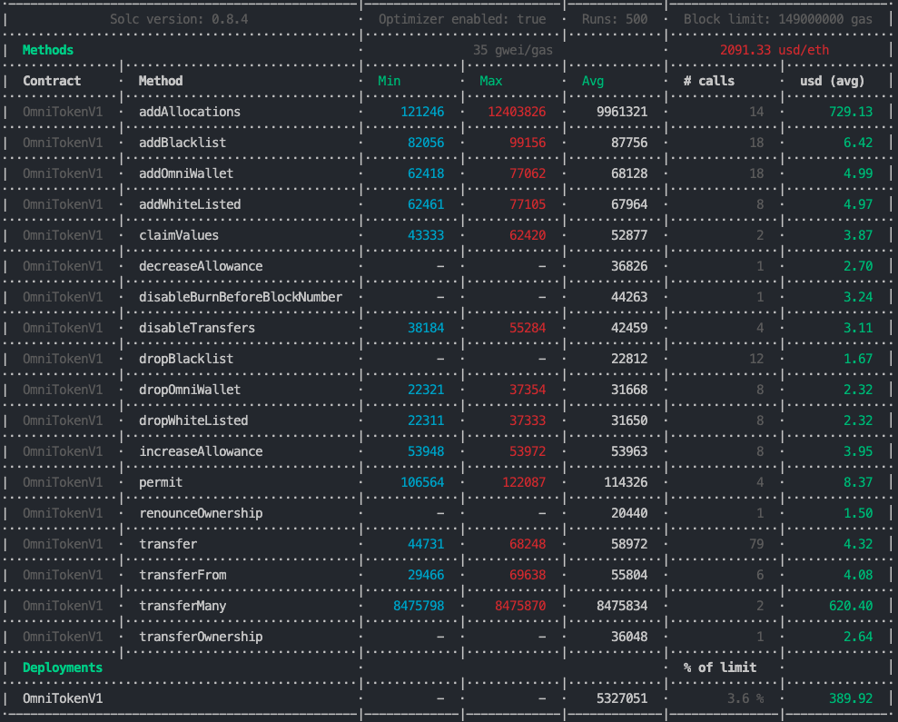
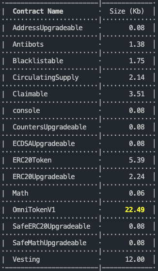

# OMNI Contracts V4

Before to Start

---

#### Validate Develop Environment

---

- Node v14.17.0 or +
- Solc v0.8.4 or +
- Hardhat v2.2.1 or +

#### Start migration

---
```
npx hardhat run scripts/deploy.ts
```
OR
```
npm run deploy
```
---
#### Start Hardhat test
---

```
npx hardhat test
```
---
## environment variables (.env file)
---

- MNEMONIC=
- INFURAKEY=
- PRIVATE_KEY=
- COINMARKETCAP_API_KEY=
- ETHERSCAN_API_KEY=
- URL_BSC=https://bsc-dataseed1.binance.org
- URL_TESTNET_BSC=https://data-seed-prebsc-1-s1.binance.org:8545
- URL_MOONBEAM_TESTNET=https://rpc.testnet.moonbeam.network

---
### Certik Audit Report

---

[Certik Audit Report, with last Review](https://www.certik.org/projects/omni)

---
### Last ETH Gas Reporter

---

- Simulation for addAllocation() and transferMany() Methods based arrays of 100 addresses



---

### Last Contract Size Reporter

---


---

# OMN-token v4
