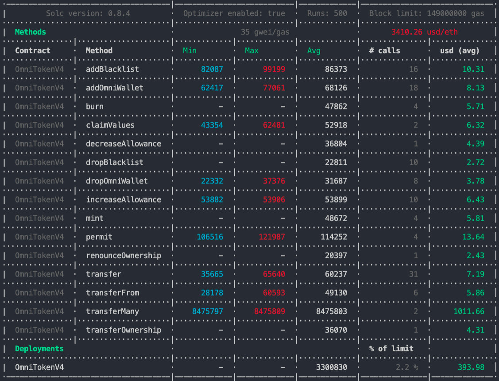
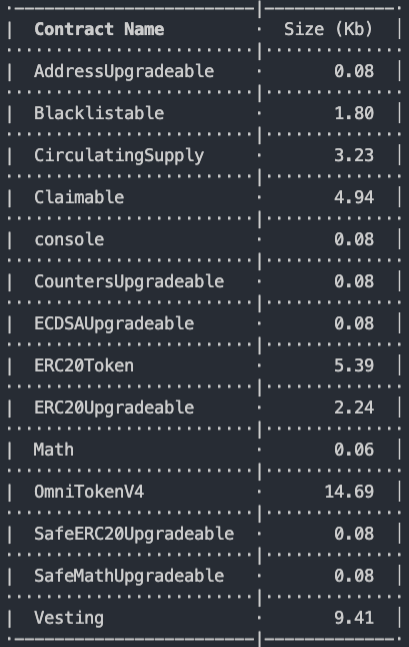

# OMNI Contracts V1

Before to Start
---
#### Validate Develop Environment
---
- Node v14.17.0 or +
- Solc v0.8.4 or +
- Hardhat v2.2.1 or +

#### Start migration
---
```
npx hardhat run scripts/deploy.ts
```
OR
```
npm run deploy
```

#### Start Hardhat test
---
```
npx hardhat test
```

## environment variables (.env file)
---
MNEMONIC=
<br/>
INFURAKEY=
<br/>
PRIVATE_KEY=
<br/>
COINMARKETCAP_API_KEY=
<br/>
ETHERSCAN_API_KEY=
<br/>
URL_BSC=https://bsc-dataseed1.binance.org
<br/>
URL_TESTNET_BSC=https://data-seed-prebsc-1-s1.binance.org:8545
<br/>
URL_MOONBEAM_TESTNET=https://rpc.testnet.moonbeam.network

### Last ETH Gas Reporter
---



### Last Contract Size Reporter
---


